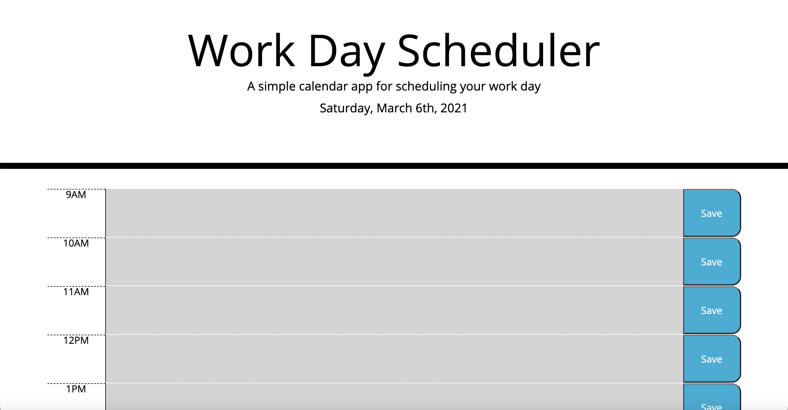
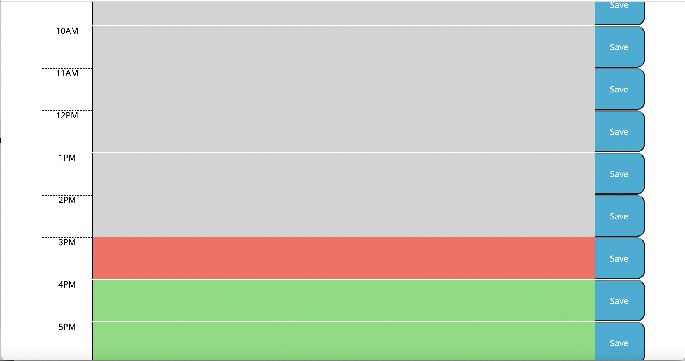
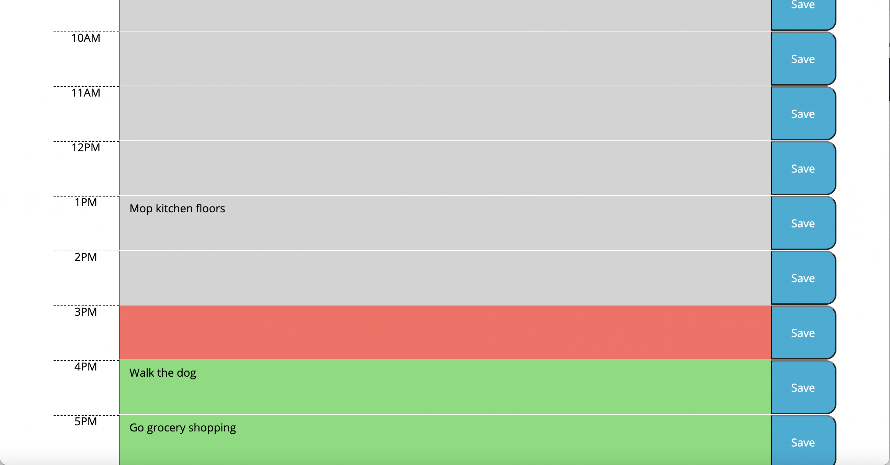
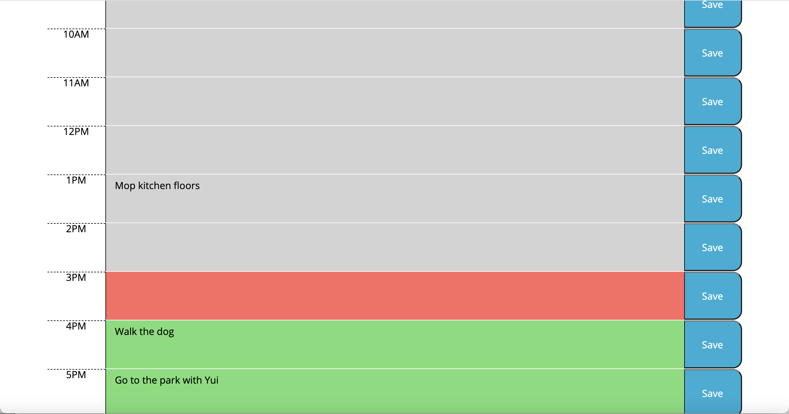

# Work-Day-Scheduler

## About

This is a simple calendar application that allows a user to save events for each hour of the day. The app was built using dynamically updated HTML and CSS powered by jQuery, with a specific emphasis on Moment.js to work with date and time.

## Application

Upon opening the link, the user is presented with a header welcoming them to the application and a display of the current date.

When the user observes the app, each time block is colored based on the current time: grey represents past hours, red is the current hour, and green represents future hours.

The user can enter any of their plans into the central text areas inside each time block. The save button to the right will save this event to the local storage.

Whenever the user refreshes the page, any information saved in the text areas will remain. In this example, the user's 5 o'clock plans changed. Here, they can delete their old plans of grocery shopping and update the text area with their new dinner date. By hitting save, this new information will be saved in their schedule.

## License

MIT License

Copyright (c) 2021 Neil Creveling

Permission is hereby granted, free of charge, to any person obtaining a copy of this software and associated documentation files (the "Software"), to deal in the Software without restriction, including without limitation the rights to use, copy, modify, merge, publish, distribute, sublicense, and/or sell copies of the Software, and to permit persons to whom the Software is furnished to do so, subject to the following conditions:

The above copyright notice and this permission notice shall be included in all copies or substantial portions of the Software.

THE SOFTWARE IS PROVIDED "AS IS", WITHOUT WARRANTY OF ANY KIND, EXPRESS OR IMPLIED, INCLUDING BUT NOT LIMITED TO THE WARRANTIES OF MERCHANTABILITY, FITNESS FOR A PARTICULAR PURPOSE AND NONINFRINGEMENT. IN NO EVENT SHALL THE AUTHORS OR COPYRIGHT HOLDERS BE LIABLE FOR ANY CLAIM, DAMAGES OR OTHER LIABILITY, WHETHER IN AN ACTION OF CONTRACT, TORT OR OTHERWISE, ARISING FROM, OUT OF OR IN CONNECTION WITH THE SOFTWARE OR THE USE OR OTHER DEALINGS IN THE SOFTWARE.
